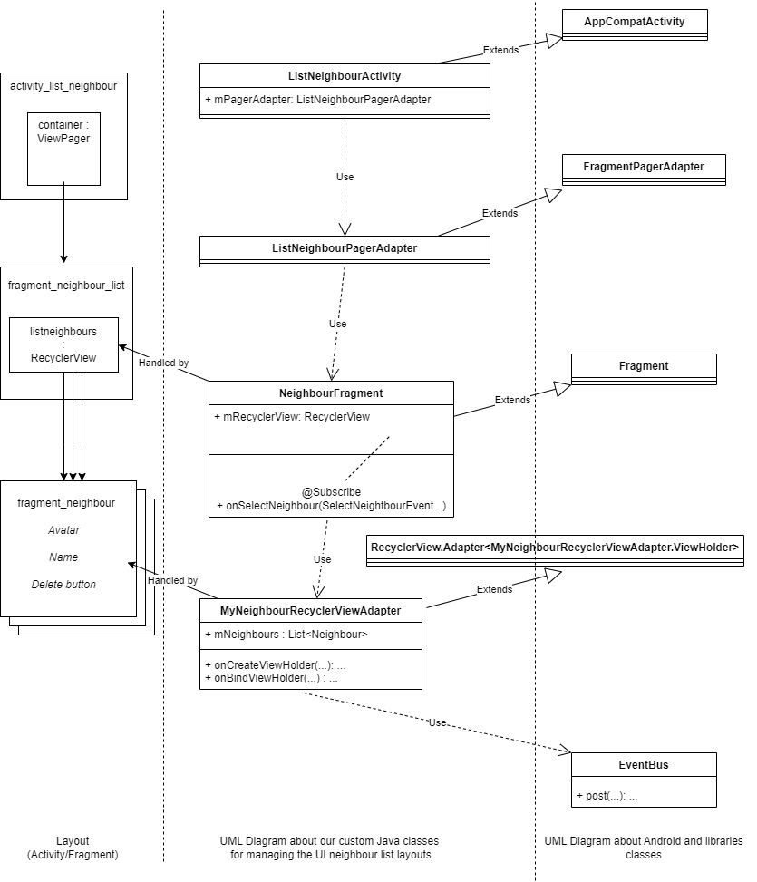

# RecyclerView Project

## Description

This is a project to demonstrate the use of the Parcelable, Serializable, ViewHolder, and RecyclerView in Android.

I used it, when I teach Android in engineering schools.

## UML Schema for the list of items displayed in the RecyclerView



## Eviter affichage en rouge des tests unitaires et instrumentalisés

Dans le build.graddle (Projet : ...) ajouter :

```gradle

classpath 'com.android.tools.build:gradle:7.2.1'
    
```
